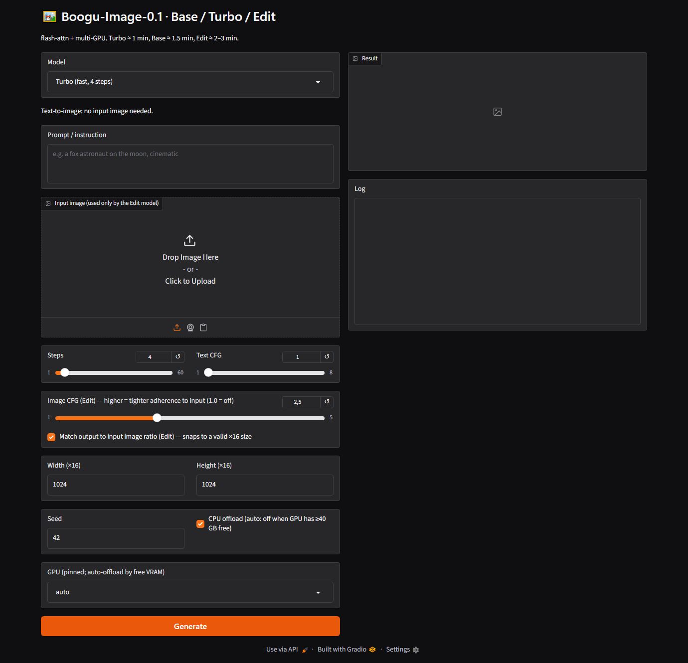

# Boogu WebUI

A lightweight **Gradio web UI + multi-GPU runner** for
[Boogu-Image-0.1](https://huggingface.co/Boogu) (Base / Turbo / Edit) — the open
unified text-to-image + image-editing model family.

The official [boogu-project/Boogu-Image](https://github.com/boogu-project/Boogu-Image)
repo ships a CLI and a ComfyUI node. This adds the missing piece: a simple browser UI
that also **fans generations out across all your GPUs in parallel**. It wraps the official
`inference.py` / `inference_turbo.py` so results match the CLI exactly.



## Features

- 🎨 **One UI for all three models** — Turbo (fast 4-step), Base (T2I), Edit (image editing).
- 🖼️ **Image editing that just works** — upload an image and it **auto-selects the Edit model**;
  no more silently running text-to-image and ignoring your input.
- 📐 **Aspect-ratio-correct edits** — the output follows your input image's ratio at ~1 MP,
  snapped to a model-valid ×16 size (e.g. an 800×500 input → 1296×816 output).
- 🎚️ **Edit consistency control** — `Image CFG` slider (defaults to 2.5) for tighter adherence
  to the source image.
- 🚀 **Parallel multi-GPU** — queued jobs run at once on *different* free GPUs via a claim-pool
  (no collisions). 3 edits finish in ~1× the time of one, not 3×.
- 🧠 **Auto VRAM management** — picks a free, flash-attn-capable card; runs the full model
  resident on ≥40 GB cards (no offload), or CPU-offloads on 24 GB cards automatically.
- 📦 **Robust downloader** — curl resume + stall-abort + per-file sha256 verification, for
  HF CDN connections that hang or write corrupt files.
- 🪟 **Windows shortcuts** — generate Desktop Start/Stop links that drive a remote Linux box over SSH.

## Requirements

- Linux + NVIDIA **Ampere or newer** GPU (RTX 30xx/40xx, A5000/A6000, …) for **flash-attn**
  (strongly recommended; Turing/Windows fall back to slower PyTorch SDPA).
- Python 3.10–3.12, ~40 GB disk per model (Base/Turbo/Edit are ~38 GB each).
- A 24 GB GPU is enough (CPU-offload); ≥40 GB runs with no offload.

## Install

```bash
git clone https://github.com/cronos3k/boogu-webui.git
cd boogu-webui
bash scripts/install.sh           # clones Boogu-Image, builds venv, installs torch+deps+flash-attn
```

`install.sh` flags: `--cuda cu128` (default `cu126`), `--no-flash` (skip flash-attn).

## Download weights

```bash
cd Boogu-Image && . .venv/bin/activate
python scripts/download_weights.py all     # Base + Turbo + Edit  (~115 GB)
# or just one:  python scripts/download_weights.py turbo
```

(The Boogu checkpoints are public — no token needed. Set `HF_TOKEN` only for gated repos.)

## Run

```bash
./ui.sh start      # launches the UI (auto-scans a free port from 8771), prints the LAN URL
./ui.sh status     # show URL + pid
./ui.sh stop
```

Open the printed `http://<host>:<port>`. Pick a model (or just upload an image → Edit),
type a prompt, hit **Generate**. Queue several — they run in parallel across your free GPUs.

### CLI (no browser)

```bash
./run_boogu.sh turbo "a fox astronaut on the moon"
./run_boogu.sh base  "a dense bilingual poster, ..."
IMAGE=path/to/img.jpg ./run_boogu.sh edit "put a red hat on the dog"
```

### Windows Start/Stop shortcuts (drives a remote host over SSH)

```powershell
powershell -File scripts\make-windows-shortcuts.ps1 -SshHost myserver -Url http://10.0.0.5:8771
```

## Configuration (env vars)

| Var | Default | Meaning |
|-----|---------|---------|
| `BOOGU_PIN_GPU` | `auto` | Preferred GPU index, or `auto` to use the pool. |
| `BOOGU_MAX_PARALLEL` | `4` | Max concurrent generations (capped by free GPUs). |
| `BOOGU_MIN_FREE_MIB` | `23000` | Min free VRAM for a card to be usable. |
| `BOOGU_PORT` | `8771` | Starting port (scans upward if busy). |
| `BOOGU_MODELS_DIR` | `models` | Where weights live. |
| `HF_TOKEN` | – | Only for gated/private repos. |

## How it works

`app.py` shells out to the official `inference.py` / `inference_turbo.py` in your
Boogu-Image checkout (it lives in that repo's root; `install.sh` puts it there), so behavior
exactly matches the upstream CLI. Each generation runs in its own subprocess on a claimed GPU.

## Performance notes

- **flash-attn matters a lot.** On an A5000 (24 GB, offload): Turbo ≈ 1 min end-to-end,
  Base ≈ 1.5 min (28 steps), Edit ≈ 2–3 min. Without flash-attn the Turbo path is dramatically
  slower (its attention falls back to SDPA's O(N²) MATH backend).
- **Offload is cheap here** — the transformer stays resident on the GPU during denoising;
  only the text encoder / VAE swap once. So a 24 GB card with offload is ~as fast as a 48 GB
  card without it; the bottleneck is steps × CFG passes, not VRAM.

## Limitations & honesty

- This is **tooling around** Boogu-Image, not a new model. All generation quality is the model's.
- It reloads the pipeline per generation (subprocess). Load is cheap (mmap), but a resident
  server would shave a few seconds — PRs welcome.
- The model card notes image-to-image **consistency** is not yet fully stable; a higher
  `Image CFG` mitigates drift but won't make every edit pixel-perfect.

## Credits & License

- Model: the **Boogu team** — https://github.com/boogu-project/Boogu-Image (Apache-2.0).
- Attention: [Dao-AILab/flash-attention](https://github.com/Dao-AILab/flash-attention).
- This wrapper: Apache-2.0 (see [LICENSE](LICENSE)).
